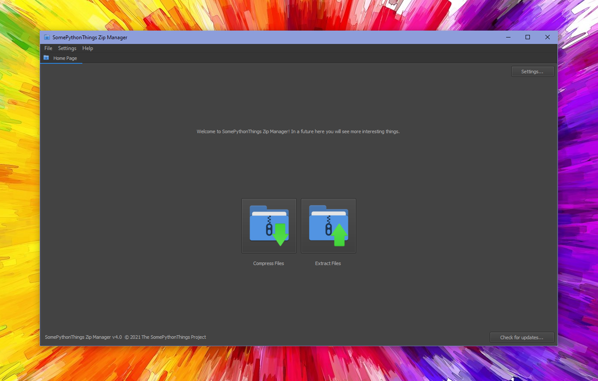
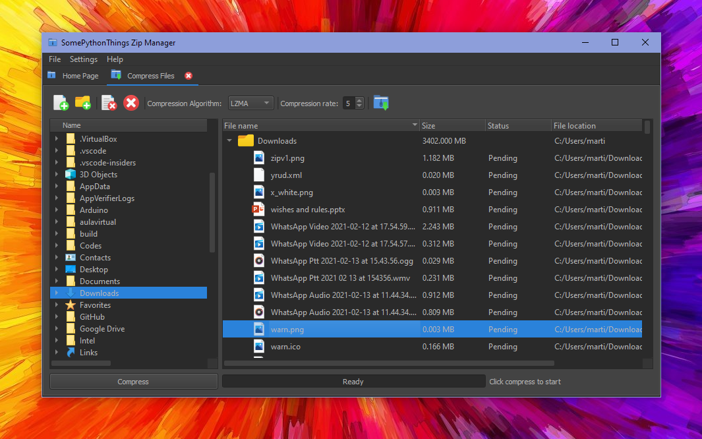
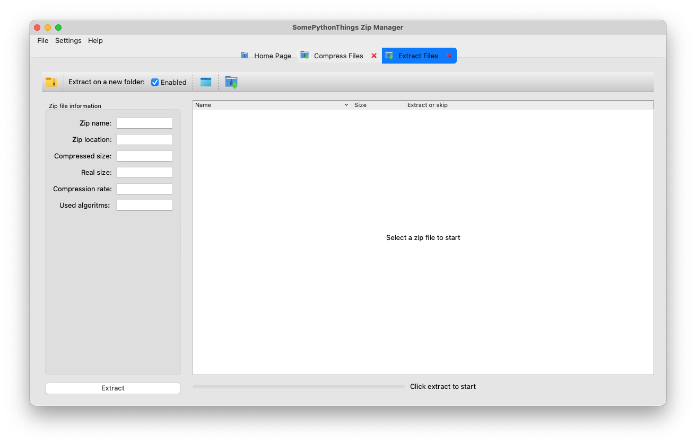

<h1>SomePythonThings Zip Manager</h1>

SomePythonThings Zip manager is an application that lets you compress and extract files in a clever way. Not as other compression applications, SomePythonThings Zip Manager has been developed to be useful. SomePythonThings Zip Manager is an open-source application, and it's also 100% free.  
<h3>On the <a href="https://github.com/martinet101/SomePythonThings-Zip-Manager/wiki">wiki</a> you'll find all the required information for the installation and how-to-use manuals.</h3>  

 
<h2>Features:</h2>
 - Fast compression and extraction 
 - Drag-and-drop support to compress and extract files 
 - Know on real time which file is being processed, which ones have been compressed and which ones are pending 
 - Open files from a zip without having to extract 
 - Tab design: work with multiple files at the same time 
 - Display Zip file information in a separate pane 
 - Easily select the algorithm and the compression strength before compressing 
 - Dark mode available, to prevent you from blowing your eyes 
 - No Administrator user rights needed to install 
 - Updates are easy and fast to install 
  

<h1>Installation</h1>
<b>You  can find a detailed installation guide on the <a href="https://github.com/martinet101/SomePythonThings-Zip-Manager/wiki/Installation">Installation Wiki</a></b>
<h2>Windows (Via winget)</h2>
Open a cmd or powershell window and run the following command:  

    winget install "SomePythonThings Zip Manager"

     
<h2>Windows (Classic way)</h2>
Download and run the .exe file, run it and click on the Install button.
<h2>macOS</h3>
Download the .dmg file and drag "SomePythonThings Zip Manager.app" to your applications folder.
<h2>Ubuntu</h2>
Download file and install the .deb file as normal. 
<b>You  can find a detailed installation guide on the <a href="https://github.com/martinet101/SomePythonThings-Zip-Manager/wiki/Installation">Installation Wiki</a></b>
  
<h1>Screenshots: 

